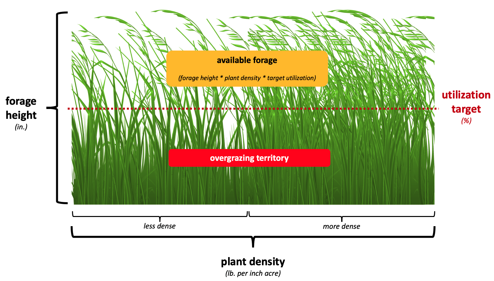

# high-density-grazing-simulator
This script simulates the potential benefit of utilizing the technique High Density Grazing.

## High Density Grazing
High Density Grazing is a tehchnique that ultimately seeks to improve the fertility of the pastures by using a denser, combined herd. The combined manure and trampling of this denser, single herd, moved regularly from paddock to paddock (where suitable recovery time is allowed) leads to greater plant density on regrowth. More plant material per acre can then support more cattle/sheep/bison/shaak.

## Model Intent
The intent of this model is to provide the max herd size that can sustainably be kept on a given plot. Optimize_paddock_structre returs how many subdivided pastures/paddocks will be necessary and how long teh combined herd can stay on each paddock. 

By inputting today's Plot forage characteristics and runnign density we have a baseline for improvement. The key variable that we are seeking to affect is plant density (in terms of lb_per_inch_acre). 

As you assume the benefits of high density grazing to plant density, you can run the implied NEW max herd for the same plot of land. The difference between this and the baseline is your implied benefit.

## Key Variables
### Plot Characteristics
```Plot()``` is primarily a holding container for ```total_acreage``` and ```list_of_paddocks```.

### Paddock Characteristics
```Paddock()``` holds all the key characteristics of the land. For future iterations of this model, every paddock will be unique and will hold variables pertaining to its state of usage and recovery. These variables are built into ```Paddock()```, but are  unused in this optimization.

For now a ```proxy_paddock``` holds the characteristics of the entire plot as if it were monolithic. These include:
- ```forage_height```(literal height of forage in inches)
- ```target_utilization``` (the amount eaten before risking overgrazing)
- ```dry_matter_per_inch_acre```(plant density, the key variable we hope HDG will affect)

<p align="center">
  
</p>

### Herd Characteristics
```Herd()``` holds the characteristics of a given herd including:
- ```avg_head_weight``` (in lbs)
- ```body_weight_eaten_daily``` (as a %, this is key to determining daily forage need)

As with ```Paddock()``` a ```proxy_herd``` is used to hold the key characteristic (```body_weight_eaten_daily```) for the sake of pasture optimization.

## Demo Walkthrough
1) Start by entering all relevant Plot, Paddock, and Herd characteristics

```python
# Original Plot Characteristics
total_acreage = 200     #in acres
forage_height = 15      #in inches
regrowth_period = 90    #in days
dry_matter_per_inch_acre = 200  #in lbs

# Herd Characteristics
avg_head_weight = 1200  #in lbs
body_weight_eaten_daily = 0.025  # as % of body weight

# Behavioral Targets
target_utilization = 0.50 #as % of forage height eaten
target_herd_density = 25000 # as herd_lb per acre
```

2) Load chracterstics to ```Plot()```,```proxy_paddock```,and ```proxy_herd```

3) Determine max_herd given land characteristics and load to holder ```Herd()```
```python
max_herd1 = max_herd_weight(plot1,proxy_herd,proxy_paddock,target_herd_density,target_utilization)

optimized_herd = Herd(max_herd1,avg_head_weight,body_weight_eaten_daily)
```

4) Determine optimal paddock structure
```python
optimize_paddock_structure(plot1,optimized_herd,proxy_paddock,target_herd_density,target_utilization)
```

5) This outputs:
- List of ```Paddock()``` objects with new characteristics
- ```[38 paddocks]``` Number of Paddocks to use in subdividing plot
- ```[5.19 acres]```Ideal Paddock Size
- ```[2.4 days]``` Length of stay on each Paddock

6) Assume benefit to plant density (in ```dry_matter_per_inch_acre```), load to new ```proxy_paddock```, and re-run optimization

7) This outputs:
- List of ```Paddock()``` objects with new characteristics
- ```[34 paddocks]``` Number of Paddocks to use in subdividing plot
- ```[5.82 acres]```Ideal Paddock Size
- ```[2.7 days]``` Length of stay on each Paddock

8) The improvement in plant density leads to the ability to provide for ```+15,763``` incremental lb or ```+13``` heads

## Disclaimers


## Future Improvements


## References & Resources
I sourced most of key assumptions from this USDA document.

[USDA PDF explaining HDG](https://www.nrcs.usda.gov/wps/PA_NRCSConsumption/download?cid=nrcseprd1630415&ext=pdf)

[Noble Research Institute](https://www.noble.org/news/publications/ag-news-and-views/2019/april/what-is-high-stock-density-grazing/#:~:text=High%20stock%20density%20grazing%20begins,forages%20and%20ultimately%20livestock%20production.)


```python
# Determine max herd capable of being sustained on land
max_herd = max_herd_weight(plot1,proxy_herd,proxy_paddock,target_herd_density,target_utilization)

optimized_herd = Herd(max_herd,avg_head_weight,body_weight_eaten_daily)

# Determine optimal paddock structure using max_herd
result = optimize_paddock_structure(plot1,optimized_herd,proxy_paddock,target_herd_density,target_utilization)
```